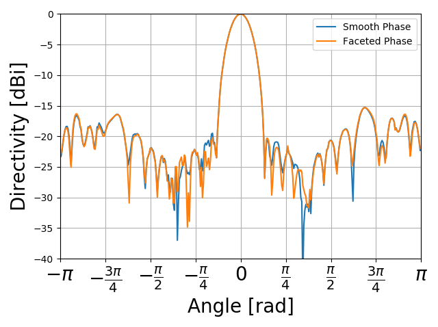

FacetedArray
============

The goal of this package is to generalize Karl's faceted array code and provide
a nice interface.

### How to use
There are two modules: `helpers` and `core`. Essentially all functionality is provided
by the `core` module. In this module, the main functions are `create_E_func` and
`create_sum_E_func`. These functions take several arguments by keyword and return
a function that can be used to find the antenna pattern for a faceted circular array.
The documentation is shown below. Note the `element_pattern` arguments should be a 
function. If you've generated a pattern from something like HFSS as a .csv file, you can
import this file into a function which will work for the element pattern argument by 
calling `create_element_pattern_func_from_csv`. 

```Python
def create_E_func(*, element_pattern, num_elements, radius, wavelen, current_mag=1):
    """ Creates a function which calculates the radiation pattern of a multimode array

    The E function is the implementation of equation (9) from Sheleg 1968
    "A Matrix-Fed Circular Array for Continuous Scanning"

    Args:
        element_pattern: Function which represents the element pattern
        num_elements: Number of elements in the array
        radius: The radius of the circular array
        wavelen: The wavelength of the operating frequency
        current_mag: Magnitude of current on an element (default: 1)

    Returns:
        E: Function which represents the circular array pattern
    """
```

The `create_sum_E_func` function returns a function which calculates the contribution 
from all modes up to a given number
``` Python
def create_sum_E_func(*, element_pattern, num_elements, radius, wavelen, phaseshifts):
    """ Creates E function which calculates radiation pattern for a sum of modes

    The E function is the implementation of equation (12) from Sheleg 1968
    "A Matrix-Fed Circular Array for Continuous Scanning"

    Args:
        element_pattern: Function which represents the element pattern
        num_elements: Number of elements in the array
        radius: Radius of the circular array
        wavelen: Wavelength of the operating frequency
        phaseshifts: Array representing phase shifts for each mode

    Returns:
        E: Function which represents the circular array pattern
    """
```

### Examples
The code in the `tests` folder provides a good introduction as to how to use this
code. It works particularly well with the HRG `emplots` python module. The example
below shows this.

#### Generating a plot
``` Python
import matplotlib.pyplot as plt
import numpy as np

from collections import deque

from emplots import rectangular

from context import facetedarray
from facetedarray.helpers import deg_to_rad
from facetedarray.core import phaseshifts, create_E_func, create_sum_E_func, create_element_pattern_func_from_csv

smoothphase = [0, -4.69984,5.00602,12.364967,19.43257,44.21539,51.1145,81.16565,107.8338,134.1925,169.2242,-140.6595,-114.2837,-58.93227,-11.99662,101.49356,136.80026]
smoothphase = [deg_to_rad(smoothphase[i]) for i in range(len(smoothphase))]

pi = np.pi
N = 32
wavelen = 6.6E-3
radius = wavelen * N / (4 * pi)

A = create_element_pattern_func_from_csv('test_files/rE_Plot_mag_1_32.csv', 3,
    'test_files/rE_Plot_phase_1_32.csv', 3)

E = create_E_func(element_pattern=A, num_elements=32, radius=radius, wavelen=wavelen)

shiftarray = phaseshifts(E, smoothphase)
sumE = create_sum_E_func(element_pattern=A, num_elements=32, radius=radius, wavelen=wavelen, phaseshifts=shiftarray)
smoothE = create_sum_E_func(element_pattern=A, num_elements=32, radius=radius, wavelen=wavelen, phaseshifts=smoothphase)

phis = np.arange(0, 2*pi, pi / 180)
mags = [sumE(phi, 16) for phi in phis]
smooth_mags = [smoothE(phi, 16) for phi in phis]

# The center value isn't at phi = 0. This rotates the magnitude array
# such that the plot is centered at 0
mags = deque(mags)
mags.rotate(len(mags) // 2)
smooth_mags = deque(smooth_mags)
smooth_mags.rotate(len(smooth_mags) // 2)

rectangular.plot(angles=phis, magnitudes=smooth_mags, label="Smooth Phase")
rectangular.plot(angles=phis, magnitudes=mags, label="Faceted Phase")
plt.tight_layout()
plt.legend()
plt.show()

```
